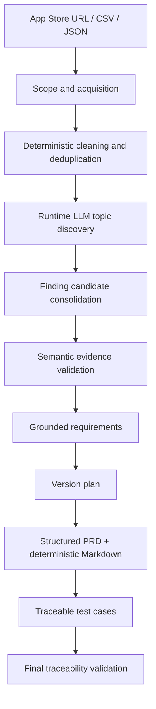

# LaienTech iOS App Review Analysis and Version Planning Assessment

## Final Submission Guide

App Review Insights is a locally runnable React + FastAPI workspace that turns App Store, CSV, or JSON reviews into evidence-grounded product planning artifacts. The normal user path is one **Start Analysis** action; the backend then persists each stage of the complete run.

### Core workflow



The central chain is always preserved:

```text
Review -> Validated Finding -> Requirement -> TestCase
```

### Delivered capabilities

- U.S. App Store customer-review acquisition with explicit storefront provenance and limitations.
- Documented CSV and JSON contracts, upload byte/row limits, invalid-row reporting, normalization, cleaning, and deterministic deduplication.
- Runtime DeepSeek semantic analysis with bounded batches, dynamic topics, cross-batch consolidation, goal-aware prompts, multilingual output, and structured Pydantic validation.
- Evidence grounding with semantic `SUPPORTS`, `CONFLICTS`, `NEUTRAL`, and `IRRELEVANT` judgments; deterministic sufficiency, confidence, evidence strength, uncertainty, and limitations.
- Grounded Requirements, VersionPlan, Structured PRD, deterministic Markdown renderer, and Requirement-linked TestCases.
- Persisted run-scoped traceability matrix, forward/reverse indexes, coverage metrics, audit events, warnings, revisions, rejections, and failure states.
- Bilingual UI (`zh-CN` default, `en-US` switch) with independent Analysis Output Language.
- Packaged Workout cached demo that works without a model key and is visibly marked as a cached result.

### AI versus deterministic logic

| Responsibility | Implementation |
| --- | --- |
| Language understanding | Runtime DeepSeek provider: topics, Finding candidates, evidence stances, Requirement language, release themes, PRD draft language, and TestCase behavior. |
| Facts and safety | Python code: source parsing, normalization, deduplication, identifiers, run scope, allowlists, evidence counts, confidence calibration, artifact dispositions, inheritance, coverage, and final validation. |
| Hybrid stages | Evidence validation and product planning combine structured model proposals with deterministic validators and revision/rejection rules. |

Codex was used to develop this repository; that is separate from the application's runtime LLM requirement. The runtime provider is selected by environment configuration and is called only for a new live analysis.

### Evidence and traceability

Model output is never treated as a database. Every generated Review ID is checked against the current `analysis_run_id` and, during batch stages, the current batch allowlist. Requirements inherit Review evidence from validated Findings, and TestCases inherit it from Requirements. Unsupported or rejected artifacts remain in audit records but cannot silently enter the final PRD.

Coverage is calculated over current-run, non-rejected artifacts. Empty denominators are `N/A` rather than a misleading 100%:

```text
Finding evidence coverage = valid Findings / all Findings
Requirement coverage = traceable non-assumption Requirements / all non-assumption Requirements
TestCase coverage = traceable non-rejected TestCases / all non-rejected TestCases
Overall coverage = valid artifact counts across the three denominators / their total denominator
```

### Data sources and limitations

The live provider accepts only a U.S. App Store URL such as:

```text
https://apps.apple.com/us/app/workout-for-women-home-gym/id839285684
```

It requests Apple's public U.S. customer-review RSS JSON feed. The feed is undocumented, mutable, rate-limited, and limited to a recent page window; the UI records these limitations and never substitutes sample data after a collection failure. A storefront supplied inside CSV/JSON is provenance metadata, not proof of live U.S. collection.

### CSV and JSON contract

Canonical fields are `id`, `text`, `title`, `rating`, `version`, `author`, `date`, `language`, `app_id`, and `storefront`. Only `text` is required. Supported aliases are documented in [REQUIREMENTS.md](REQUIREMENTS.md): for example `review_id`, `review_text`, `score`, `app_version`, `reviewer`, `created_at`, `lang`, and `country_code`. CSV must be UTF-8/UTF-8 BOM with a header. JSON must be an array or exactly `{ "reviews": [...] }`. Invalid rows are reported; malformed files, zero valid rows, files over 10 MiB, or more than 10,000 parsed records fail explicitly without silent truncation. All accepted data becomes the same run-scoped `Review` model.

### Runtime model and prompts

The interview build implements one provider: DeepSeek through its OpenAI-compatible JSON endpoint. Configure `LLM_PROVIDER=deepseek`, `LLM_MODEL`, `LLM_BASE_URL`, and `LLM_API_KEY`. Core prompt files are under `backend/app/prompts/`:

```text
topic_discovery.md
finding_candidate.md
topic_consolidation.md
evidence_validation.md
requirement_generation.md
requirement_grounding.md
version_planning.md
prd_generation.md
testcase_generation.md
```

Structured responses are validated with Pydantic, finite retries are used for retryable provider/structured-output failures, and no secret, raw model response, or full Review text is stored in diagnostics.

### Installation

Prerequisites: Python 3.9+ and Node.js 20+ (the verified environment used Python 3.9.7 and Node 24.12.0).

From a fresh checkout on Windows PowerShell:

```powershell
Copy-Item .env.example .env

cd backend
python -m venv .venv
.\.venv\Scripts\python.exe -m pip install -r requirements-dev.txt
.\.venv\Scripts\python.exe -m uvicorn app.main:app --host 127.0.0.1 --port 8000
```

In a second terminal:

```powershell
cd frontend
npm.cmd ci
npm.cmd run dev -- --host 127.0.0.1
```

Open <http://127.0.0.1:5173>. The backend health check is <http://127.0.0.1:8000/api/health>.

### Environment variables

The tracked [.env.example](.env.example) contains safe values only. Copy it to the untracked project-root `.env`.

| Variable | Required now? | Purpose |
| --- | --- | --- |
| `VITE_API_BASE_URL` | No | Frontend URL for the FastAPI API; default `http://localhost:8000`. |
| `BACKEND_HOST`, `BACKEND_PORT`, `CORS_ORIGINS` | No | Local backend and frontend connectivity. |
| `SQLITE_DATABASE_PATH` | No | Local SQLite path; default is under `backend/data/`. |
| `LLM_PROVIDER` | For live analysis | Set to `deepseek`. |
| `LLM_MODEL` | For live analysis | DeepSeek model name, for example `deepseek-v4-flash`. |
| `LLM_BASE_URL` | No | Defaults to `https://api.deepseek.com`. |
| `LLM_API_KEY` | For live analysis | A DeepSeek API key from the DeepSeek platform. Never commit it. |
| `LLM_*` batching/retry settings | No | Prompt batch size, timeout, output, retry, temperature, and proxy behavior. |
| `EVIDENCE_*`, `PRODUCT_*` | No | Centralized deterministic validation thresholds. |

Without `LLM_API_KEY`, backend health, deterministic imports, and the cached demo remain available. A new live analysis stops with a clear `LLM_NOT_CONFIGURED` error and creates no fake Topics, Findings, Requirements, PRD, or TestCases.

### Offline cached demo

Click **查看示例分析 / View Demo Analysis** on the home page. The packaged `cached_results/workout_demo.json` contains the complete pipeline result, including cleaned Reviews, Topics, Findings, Requirements, VersionPlan, PRD, TestCases, and final traceability. Its `cached_demo` metadata stores `CACHED_DEMO=true`, source, original collection time, model provider/model, and original analysis time. The UI labels it **Cached Demo Result / 示例缓存结果**; it is never presented as a new live run. See [cached_results/README.md](cached_results/README.md).

### Sample data

`sample_data/` contains compatible Workout input, unknown-domain Music CSV, mixed-language JSON, dirty/duplicate input, conflicting evidence, insufficient evidence, and larger semantic fixtures. These are synthetic development inputs, not App Store or cached results. See [sample_data/README.md](sample_data/README.md).

### Testing and verification

From `backend/`:

```powershell
.\.venv\Scripts\python.exe -m pytest -q
```

From `frontend/`:

```powershell
npm.cmd run build
npm.cmd test
```

`npm.cmd test` starts an isolated local FastAPI/Vite pair and runs the no-key cached-demo, bilingual persistence, error-state, and responsive Chromium checks. Screenshots are written to ignored `output/playwright/phase7/`. The final verified suite is documented in [docs/FINAL_ACCEPTANCE.md](docs/FINAL_ACCEPTANCE.md), and the checklist is in [docs/SUBMISSION_CHECKLIST.md](docs/SUBMISSION_CHECKLIST.md).

### Project structure

```text
backend/app/       FastAPI API, Pydantic models, providers, services, validators
backend/tests/     deterministic ingestion, semantic, evidence, planning, traceability tests
frontend/src/      React workspace, i18n resources, API client, responsive panels
frontend/e2e/      reproducible no-key cached-demo browser acceptance
backend/app/prompts/  versioned runtime prompt resources
sample_data/       synthetic compatible fixtures
cached_results/    clearly labeled complete offline demo artifact
docs/              phase acceptance and submission reports
```

### Known limitations

- Apple’s public U.S. review feed is not a stable documented API and exposes a bounded recent window.
- DeepSeek availability, quota, model behavior, and network access are external dependencies for live analysis.
- The application uses one FastAPI process, one in-process worker path, SQLite, and frontend polling. Restarting the process interrupts an active provider request, while persisted completed stages remain inspectable.
- Runtime semantic and evidence judgments are probabilistic; schema, ID, evidence, and traceability validators prevent unsupported identifiers and claims from silently becoming final artifacts, but cannot make language understanding infallible.
- Complex charting, advanced exports, manual Requirement editing, multiple providers, authentication, distributed queues, RAG, vector databases, LangGraph, and multi-agent orchestration remain intentionally out of scope.

### Development process

The incremental Git history follows the interview phases from specification baseline through ingestion, runtime semantic analysis, evidence validation, product planning, final traceability, and stabilization. Phase acceptance reports preserve the actual run IDs, hard gates, limitations, and human spot checks:

- [Phase 3 acceptance](docs/PHASE3_ACCEPTANCE.md)
- [Phase 4 acceptance](docs/PHASE4_ACCEPTANCE.md)
- [Phase 5 acceptance](docs/PHASE5_ACCEPTANCE.md)
- [Phase 6 acceptance](docs/PHASE6_ACCEPTANCE.md)


## Background

This assessment uses the following real iOS app as the primary development and demonstration example:

https://apps.apple.com/us/app/workout-for-women-home-gym/id839285684

If you have access to an overseas network environment, use the U.S. App Store link above. If not, and the U.S. link cannot be opened or redirects, use the China App Store link only to open the app detail page:

https://apps.apple.com/cn/app/workout-for-women-home-gym/id839285684

Regardless of which link is used to open the page, the review data used in this assessment must come from the U.S. App Store storefront.

You are expected to complete a full product analysis workflow around App Store user reviews, covering data collection, review cleaning, review classification, issue analysis, version planning, PRD writing, and test case design. The final results should be presented through a runnable UI.

This assessment focuses on the candidate's vibe coding ability. Candidates should use vibe coding to complete the full process: collecting data, cleaning and analyzing reviews, abstracting product requirements, planning versions, designing test cases, and productizing the analysis workflow into an interactive experience.

## Objective

Build a runnable tool or web application. In the UI, the user should be able to enter a valid U.S. App Store app link. Use the following link as the primary example:

```text
https://apps.apple.com/us/app/workout-for-women-home-gym/id839285684
```

The user should also be able to provide an analysis goal or constraint, such as focusing on subscription conversion, workout usability, a specific app version, or low-rating reviews. The system must not depend on app-specific hard-coded categories, findings, requirements, or test cases.

After the user clicks "Start", the system should automatically complete the following workflow and display the results in the UI:

1. Determine the analysis scope based on the user's goal and the available data.
2. Collect review data for the app.
3. Clean, deduplicate, and structure the review data.
4. Dynamically classify and analyze the reviews, rather than relying only on fixed keyword mappings or a predefined issue taxonomy.
5. Evaluate whether the available evidence is sufficient, and identify conflicting feedback, uncertainty, and data limitations.
6. Create an update plan based on the analysis, produce a PRD, and split the scope into multiple versions when necessary.
7. Generate test cases based on the PRD, with each test case linked to its requirement and source user reviews.
8. Validate the traceability chain from reviews to findings, requirements, and test cases. Unsupported conclusions must be removed, revised, or explicitly marked as assumptions.
9. Display the execution progress in the UI, including the stages, intermediate results, validation results, errors, and revisions.
10. Display the interim and final deliverables, including raw reviews, cleaned data, classification results, findings, PRD drafts, and test case drafts.

## AI Requirements

- At least one core semantic task must be model-driven. Suitable tasks include dynamic topic discovery, issue consolidation, evidence-grounded analysis, requirement generation, or test case generation. Implementing all semantic analysis only through fixed keywords, regular expressions, lookup tables, or manually predefined mappings does not meet this requirement.
- Deterministic rules are encouraged where they are appropriate, including data collection, deduplication, field normalization, validation, and safety checks. The submission should explain why rules, statistical methods, or language models were chosen for each stage.
- Every major finding must include its source review IDs or excerpts, supporting sample count, confidence or uncertainty, and any material conflicting evidence. Model-generated conclusions must remain distinguishable from deterministic statistics.
- The submission must document the model and provider used, the main prompts or tool definitions, model configuration, failure-handling strategy, and measures used to reduce hallucinations and unsupported conclusions.
- Hosted APIs, local models, or other model runtimes may be used. Secrets must be supplied through environment configuration and must not be committed to the repository.

## Deliverables

Submit a GitHub project link and ensure the project can run locally.

The GitHub project should include complete source code, dependency configuration, running instructions, an explanation of the data collection method, and any necessary sample output or cached data so that interviewers can review the results even when external network access is unavailable. Cached results must be clearly labeled and must not replace the ability to process a previously unseen input when the required network and model configuration are available.

The application must also support importing review data from a documented JSON or CSV format. During evaluation, interviewers may provide a different valid App Store link, a previously unseen compatible review dataset, or a new analysis goal. The submission will be evaluated on whether it can produce grounded results without app-specific hard coding.

The GitHub project should preserve a complete commit history to show the candidate's implementation process, iteration process, and use of vibe coding.

## Technical Requirements and Notes

- There is no restriction on the tech stack.
- You may use frontend frameworks, backend frameworks, data analysis libraries, visualization libraries, natural language processing models, or large language model APIs.
- You may use public APIs or third-party data collection libraries, but you must clearly explain the data source and its limitations.
- Pay attention to request rate limits and avoid placing abnormal load on the target site.
- Provide a sample environment file or equivalent configuration instructions, but do not include API keys or other secrets.
- A non-runnable document-only submission is not acceptable.

## Current Implementation Notes — Phase 6

Phase 6 adds the ordinary-user workflow promised by the original assignment. The frontend performs deterministic ingestion and then starts one persisted full-pipeline job from the same **Start Analysis** action. The backend sequentially reuses the existing Semantic Analysis, Evidence Validation, and Product Planning services before running a deterministic `FinalTraceabilityValidator`. Individual Phase 3–5 endpoints remain available only as focused debug/recovery surfaces.

The final validator produces a run-scoped structured matrix with `review_id`, `finding_id`, `requirement_id`, `version`, `test_case_id`, evidence role, and validation dispositions. It also materializes forward `Review -> Finding -> Requirement -> TestCase` indexes and reverse `TestCase -> Requirement -> Finding -> Review` indexes. Unknown or cross-run IDs, broken evidence inheritance, rejected PRD references, and invalid TestCase evidence are hard failures; weak/conflicted/unsupported Findings, assumptions, revisions, rejections, source limitations, and partial analysis remain explicit warnings.

Coverage uses the documented current-run, non-rejected denominators:

```text
Finding evidence coverage = Findings with valid semantic supporting Reviews / all Findings
Requirement coverage = traceable non-assumption Requirements / all non-assumption Requirements
Test Case coverage = traceable non-rejected TestCases / all non-rejected TestCases
Overall coverage = sum of the three valid artifact counts / sum of the three denominators
```

An empty denominator is displayed as `N/A`. Final full-pipeline states add `COMPLETED_WITH_WARNINGS` and `VALIDATION_FAILED`; the legacy `WARNING` value remains valid for standalone stage completion. Progress is derived from the persisted current stage and that stage's persisted progress—never from a timer or frontend self-increment.

Run audit events preserve stage starts/completions, validations, revisions, rejections, warnings, and errors. The bilingual responsive Analysis Workspace exposes Overview, raw Reviews, cleaning, Topics/Candidates, validated Findings, Requirements, VersionPlan, deterministic PRD, TestCases, final Traceability, and Run Audit without modifying source Review text or stored English enums.

```http
POST /api/analysis/{analysis_run_id}/pipeline
GET  /api/analysis/{analysis_run_id}/workspace
GET  /api/analysis/{analysis_run_id}/traceability
POST /api/analysis/{analysis_run_id}/traceability/validate
```

Apple's currently working U.S. customer-review path is `id={app_id}/sortby=mostrecent/page={page}/json`. The provider does not inherit system proxy variables by default because a broken Windows proxy can fail TLS while direct access succeeds. Set `APP_STORE_TRUST_ENVIRONMENT_PROXY=true` only when a verified local proxy is required.

The complete Phase 6 verification record, real run identifiers, failure checks, and responsive screenshot paths are in [`docs/PHASE6_ACCEPTANCE.md`](docs/PHASE6_ACCEPTANCE.md).

## Current Implementation Notes — Phase 5

Phase 5 converts current-run validated Findings into a grounded product plan while preserving the executable chain `Review -> Finding -> Requirement -> TestCase`. Only `SUPPORTED` Findings enter formal Requirement generation in the interview build. `WEAK`, `INSUFFICIENT`, `UNSUPPORTED`, and—by the documented conservative rule—`CONFLICTED` Findings remain visible upstream but are excluded from formal Requirements. This prevents weak or unresolved evidence from becoming a high-priority product promise.

The configured runtime LLM creates structured Requirement drafts, semantic grounding decisions, a VersionPlan draft, a StructuredPRD draft, and TestCase drafts. Deterministic application code owns all identifiers, evidence inheritance, run isolation, priority calibration, factual PRD normalization, Markdown rendering, and traceability coverage. The model never supplies Requirement or TestCase Review IDs.

### Requirement validation and priority

Each Requirement passes schema validation, current-run Finding reference validation, semantic claim-boundary validation, Acceptance Criteria quality checks, deterministic evidence inheritance, and deterministic priority calibration. `Requirement.review_ids` is the exact stable union of the referenced Findings' validated `supporting_review_ids`. The original `RequirementDraft`, semantic decision, validation result, and final Requirement are retained separately.

Default priority rules are centralized in configuration:

- assumptions are capped at `P3`;
- non-`SUPPORTED` evidence is capped at `P2` and is not currently admitted to formal generation;
- high impact with at least 20 supporting Reviews and confidence at least 0.85 recommends `P0`;
- high/medium impact with at least 8 supporting Reviews and confidence at least 0.70 recommends `P1`;
- remaining eligible Requirements recommend `P2`.

If the LLM proposal differs, code stores `recommended_priority`, `final_priority`, and `priority_reason`, marks the artifact `REVISED`, and preserves the original draft.

### Version Plan, Structured PRD, and Test Cases

The VersionPlan assigns every accepted/revised Requirement exactly once; unknown, duplicate, cross-run, or omitted Requirement IDs fail validation. PRD generation follows `StructuredPRD draft -> reference/fact validation -> deterministic normalization -> deterministic Markdown renderer`. Factual sections, provenance, counts, assumptions, and limitations are reconstructed from validated Findings, Requirements, VersionPlan data, and run metadata—not accepted as uncontrolled model prose.

Every TestCase must reference an accepted/revised current-run Requirement, contain observable steps and expected results, and inherits the exact `Requirement.review_ids` set. Final validation calculates Finding, Requirement, TestCase, and overall traceability coverage. Any broken inheritance, unknown/cross-run ID, unsupported formal Finding, or invalid final PRD reference is a hard failure; no fake downstream artifact is generated after provider or schema failure.

Phase 5 prompts live in `backend/app/prompts/`: `requirement_generation.md`, `requirement_grounding.md`, `version_planning.md`, `prd_generation.md`, and `testcase_generation.md`. The run persists `RequirementDraft`, Requirement validation/revision, `VersionPlanDraft`, `StructuredPRDDraft`, PRD validation, `TestCaseDraft`, TestCase validation, and final artifacts after each completed stage.

### Phase 5 API and configuration

```http
POST /api/analysis/{analysis_run_id}/product-plan
GET  /api/analysis/{analysis_run_id}/product-plan
GET  /api/analysis/{analysis_run_id}/product-plan/prd.md
```

The aggregate `GET /api/analysis/{analysis_run_id}` response includes the product-planning summary for polling. The final endpoint downloads the validated, deterministically rendered artifact as `PRD.md`.

Optional non-secret settings are documented in `.env.example`:

```text
PRODUCT_FINDING_BATCH_SIZE=8
PRODUCT_ACCEPTANCE_CRITERIA_MIN_COUNT=2
PRODUCT_ACCEPTANCE_CRITERION_MIN_CHARS=8
PRODUCT_P0_MIN_SUPPORT_COUNT=20
PRODUCT_P0_MIN_CONFIDENCE=0.85
PRODUCT_P1_MIN_SUPPORT_COUNT=8
PRODUCT_P1_MIN_CONFIDENCE=0.70
```

The real smoke command uses the configured runtime provider, never prints the API key, verifies exact evidence inheritance, and writes an inspectable UTF-8 PRD artifact under ignored local data:

```powershell
cd backend
.\.venv\Scripts\python.exe scripts\real_product_planning_smoke.py <RUN_ID> --review-count 5
```

The complete Phase 5 verification record is in [`docs/PHASE5_ACCEPTANCE.md`](docs/PHASE5_ACCEPTANCE.md). Phase 6 now builds the final cross-artifact Dashboard and validator on these preserved Phase 5 drafts, validations, final artifacts, and source links.

## Phase 4 Evidence Validation Foundation

Phase 4 converts preserved `FindingCandidate` objects into separate validated `Finding` objects. It first rejects unknown, duplicate, or cross-run Review references with deterministic code. The configured runtime LLM then classifies each in-scope Review against the exact candidate claim as `SUPPORTS`, `CONFLICTS`, `NEUTRAL`, or `IRRELEVANT`. Only validated `SUPPORTS` and `CONFLICTS` records enter the final Finding evidence lists; every judgment remains available in a run-scoped `EvidenceValidationAudit`.

Conflict discovery is bounded rather than `Finding × all Reviews`: it always validates every candidate Review, then adds Reviews from overlapping model-derived Topic lineage and same-Topic Finding Candidates up to `EVIDENCE_CONFLICT_POOL_MAX_REVIEWS`. Reviews are sent in batches of `EVIDENCE_BATCH_SIZE`. Source `Review.text` and the Phase 3 candidate are never overwritten.

### Evidence status and confidence

The model does not assign final confidence or status. Code calculates:

```text
directional_count = support_count + conflict_count
support_ratio = support_count / directional_count
conflict_ratio = conflict_count / directional_count
evidence_density = directional_count / validated_review_count

confidence = clamp(
  0.40 * average_support_relevance
  + 0.30 * support_ratio
  + 0.20 * sample_factor
  + 0.10 * evidence_density
  - 0.20 * conflict_ratio,
  0,
  1
)
```

With the default configuration, zero support is `UNSUPPORTED`; one supporting Review is `INSUFFICIENT`; material evidence on both sides is `CONFLICTED`; at least four supports, a support ratio of at least 0.70, and sufficient semantic relevance is `SUPPORTED`; remaining supported claims are `WEAK`. `HIGH`, `MEDIUM`, and `LOW` Evidence Strength are derived from status, sample volume, and calculated confidence. The thresholds are centralized in environment configuration and tested.

After the formula, deterministic status caps calibrate conclusion confidence so a tiny, unsupported, insufficient, or materially conflicted sample cannot display strong confidence merely because its few judgments are internally consistent. Default caps are 0.69 for `WEAK`, 0.74 for `CONFLICTED`, 0.45 for `INSUFFICIENT`, and 0.20 for `UNSUPPORTED`.

Final Findings expose supporting/conflicting Reviews, status, confidence, Evidence Strength, evidence-derived uncertainty, and only limitations actually present in the run. Unsupported candidates remain in the audit and are marked ineligible for future Requirement generation. Phase 4 does not generate Requirements, a VersionPlan, PRD, TestCases, or final traceability output.

The full Phase 4 verification record is in [`docs/PHASE4_ACCEPTANCE.md`](docs/PHASE4_ACCEPTANCE.md).

### Phase 4 configuration

The existing DeepSeek settings are reused. Optional deterministic evidence settings are documented in `.env.example`:

```text
EVIDENCE_BATCH_SIZE=20
EVIDENCE_CONFLICT_POOL_MAX_REVIEWS=60
EVIDENCE_SEMANTIC_RELEVANCE_THRESHOLD=0.55
EVIDENCE_MIN_RELEVANT_REVIEWS=2
EVIDENCE_SUPPORTED_MIN_COUNT=4
EVIDENCE_SUPPORTED_MIN_RATIO=0.70
EVIDENCE_CONFLICT_MIN_COUNT=2
EVIDENCE_CONFLICT_RATIO_THRESHOLD=0.30
EVIDENCE_HIGH_STRENGTH_MIN_COUNT=8
EVIDENCE_HIGH_STRENGTH_MIN_CONFIDENCE=0.80
EVIDENCE_MEDIUM_STRENGTH_MIN_CONFIDENCE=0.55
EVIDENCE_CONFIDENCE_SAMPLE_CAP=10
EVIDENCE_WEAK_CONFIDENCE_CAP=0.69
EVIDENCE_CONFLICTED_CONFIDENCE_CAP=0.74
EVIDENCE_INSUFFICIENT_CONFIDENCE_CAP=0.45
EVIDENCE_UNSUPPORTED_CONFIDENCE_CAP=0.20
```

Run the real evidence smoke against a persisted Phase 3 run without printing the API key:

```powershell
cd backend
$env:PYTHONDONTWRITEBYTECODE='1'
.\.venv\Scripts\python.exe scripts\real_evidence_smoke.py <RUN_ID> `
  --candidate-id <FC_ID> --candidate-id <FC_ID>
```

## Phase 3 Semantic Analysis Foundation

Phase 3 adds runtime, model-driven semantic analysis after deterministic ingestion and cleaning. The configured DeepSeek model receives bounded batches of normalized Review fields plus the optional analysis goal. It dynamically discovers dataset-specific Topics, extracts structured `FindingCandidate` user problems, and performs a model-driven cross-batch consolidation. These remain explicitly unvalidated candidates; Phase 4 consumes them without overwriting them and stores validation audits and final Findings separately.

The final runtime acceptance evidence is recorded in [`docs/PHASE3_ACCEPTANCE.md`](docs/PHASE3_ACCEPTANCE.md).

### Runtime LLM configuration

Configure the untracked project-root `.env`:

```text
LLM_PROVIDER=deepseek
LLM_MODEL=deepseek-v4-flash
LLM_BASE_URL=https://api.deepseek.com
LLM_API_KEY=<your DeepSeek API key>
LLM_REVIEW_BATCH_SIZE=25
LLM_CONSOLIDATION_GROUP_SIZE=4
LLM_MAX_RETRIES=2
LLM_REQUEST_TIMEOUT_SECONDS=180
LLM_MAX_OUTPUT_TOKENS=32768
LLM_TEMPERATURE=0.2
LLM_THINKING_ENABLED=false
LLM_TRUST_ENVIRONMENT_PROXY=false
```

Obtain the key from the DeepSeek platform. The key is loaded as a secret and is never logged. JSON Output is requested from DeepSeek, the expected Pydantic JSON Schema is included in each prompt, and every response is validated again locally. `LLM_TRUST_ENVIRONMENT_PROXY=false` avoids inheriting broken system proxy settings; set it to `true` only when the local network requires a correctly configured proxy.

### Prompt and batching strategy

Prompts live in `backend/app/prompts/`: `topic_discovery.md`, `finding_candidate.md`, and `topic_consolidation.md`. They require generated text in the resolved Analysis Output Language and prohibit fabricated reviews/IDs, requirements, PRDs, version plans, test cases, and final evidence claims.

All cleaned reviews are analyzed in deterministic ordered batches of `LLM_REVIEW_BATCH_SIZE`; Phase 3 does not sample (`sampling_strategy=NONE`). Only Review ID, rating, title, text, version, language, and date are sent—never `raw_data`. Batch responses may cite only the current batch. Cross-batch consolidation is hierarchical: each request processes at most `LLM_CONSOLIDATION_GROUP_SIZE` source units, persists a round checkpoint, and validates the exact Review-to-batch lineage before the next round. A failed consolidation can resume from the persisted batch results or latest completed consolidation round instead of repeating topic discovery and finding extraction.

The provider records safe diagnostics for `finish_reason`, token usage, JSON parse location, and Pydantic error locations without logging API keys, review text, or raw model content. Output truncation is not retried with the same request; empty content, malformed JSON, schema mismatch, invalid IDs, timeouts, and retryable provider failures use at most `LLM_MAX_RETRIES` correction retries. If an otherwise valid consolidation omits source lineage, deterministic repair carries the original unmerged source candidate forward and records a revision; it never assigns an omitted Review to a different model-generated claim.

### Language and transparency

UI locale and Analysis Output Language are independent. The request supports `FOLLOW_UI`, `zh-CN`, and `en-US`; source `Review.text` is never translated or modified. The run records total/analyzed reviews, batch size/count, sampling strategy, provider/model, analysis goal, selected/resolved output language, stage progress, revisions, errors, and run-scoped topic/finding/consolidation audit artifacts.

### Phase 3 boundary

- `FindingCandidate` remains `UNVALIDATED_CANDIDATE`, not the final `Finding` model; Phase 4 produces separate validation and Finding records.
- A single FastAPI worker runs background tasks in-process; process restarts can interrupt the active request, while completed batch work and completed consolidation rounds remain resumable.
- DeepSeek API availability, account quota, regional/network access, and model behavior are external dependencies.
- The Phase 3 service itself stops at unvalidated Finding Candidates; downstream Requirements, VersionPlan, PRD, TestCases, and final traceability are implemented by the later persisted services and unified Phase 6 orchestrator.

Run the real-model smoke test without exposing the key:

```powershell
cd backend
$env:PYTHONDONTWRITEBYTECODE='1'
.\.venv\Scripts\python.exe scripts\real_llm_smoke.py
```

## Phase 2 Data Foundation

The current application implements deterministic review ingestion and cleaning for three inputs: a U.S. App Store URL, CSV upload, and JSON upload. All three produce the same run-scoped `Review` model before any semantic analysis. Phase 2 does not call an LLM.

### App Store source and limitations

Live collection uses Apple's storefront-specific public customer-review RSS JSON feed:

```text
https://itunes.apple.com/us/rss/customerreviews/id={app_id}/sortby=mostrecent/page={page}/json
```

The provider accepts only `https://apps.apple.com/us/app/.../id{numeric_id}` input, requests the `us` feed, and records `source`, `storefront`, `collection_time`, and `source_limitations`. This is not visible-page HTML scraping. The public RSS feed is not documented as a stable API, may change or become unavailable, exposes only recent feed pages, and can be affected by network/rate limits. A failure is reported explicitly; the application never fabricates reviews or silently substitutes sample data.

### CSV contract

CSV must use UTF-8 or UTF-8 with BOM and include a header. `text` is required. Canonical fields are `id`, `title`, `text`, `rating`, `version`, `author`, `date`, `language`, `app_id`, and `storefront`. Documented aliases are:

```text
id <- review_id | source_review_id
text <- review | review_text | content | body | comment
title <- review_title
rating <- score | stars | star_rating
version <- app_version | review_version
author <- user | username | reviewer
date <- created_at | review_date
language <- lang | locale
app_id <- application_id
storefront <- country | country_code | store
```

### JSON contract

JSON must use UTF-8 and be either an array of review objects or exactly `{ "reviews": [...] }`. Review objects use the same canonical fields and aliases as CSV. Arbitrary top-level wrappers are rejected.

### Limits and deterministic cleaning

Defaults are 10 MiB per upload and 10,000 records, configurable with `MAX_UPLOAD_BYTES` and `MAX_REVIEW_ROWS`. Cleaning collapses whitespace without changing meaning, normalizes optional strings/language/date/rating, rejects empty text and invalid typed fields, retains `raw_data`, and assigns stable run-local IDs such as `R000001`. Deduplication first uses `(source, source_review_id)`; records without a source ID use a SHA-256 fingerprint of normalized title, text, and rating. No embeddings, semantic similarity, or LLM deduplication are used.

`sample_data/` contains clearly labeled synthetic sample files for development and offline verification. They are not live or cached App Store results.

### Local run

Use Python 3.9+ and Node.js 20+.

```powershell
# project root
Copy-Item .env.example .env

# backend
cd backend
python -m venv .venv
.\.venv\Scripts\python.exe -m pip install -r requirements-dev.txt
.\.venv\Scripts\python.exe -m uvicorn app.main:app --host 127.0.0.1 --port 8000

# frontend (another terminal, from project root)
cd frontend
npm.cmd install
npm.cmd run dev
```

Open `http://127.0.0.1:5173`. The health endpoint is `http://127.0.0.1:8000/api/health`. Run backend tests with `.\.venv\Scripts\python.exe -m pytest` from `backend/`, and build the frontend with `npm.cmd run build` from `frontend/`.

## Evaluation Criteria

This assessment focuses on whether the candidate can turn real user reviews into an executable product plan. The evaluation will mainly consider:

- Whether the data is authentic and reproducible, with a clear explanation of its source and limitations.
- Whether review cleaning, classification, and analysis are reasonable, and whether they surface concrete user problems.
- Whether model-driven semantic analysis adds capability beyond fixed rules and generalizes to previously unseen reviews, apps, and analysis goals.
- Whether findings distinguish evidence, deterministic statistics, model-generated conclusions, uncertainty, and conflicting feedback.
- Whether the PRD is grounded in user problems, with clear requirement boundaries, priorities, and version planning.
- Whether the test cases cover the PRD and can be traced back to the corresponding user reviews.
- Whether the UI clearly presents the workflow and results, and whether the project can run locally with clear delivery instructions.

## Important Notes

- This is not merely a web scraping task, nor is it merely a UI presentation task.
- The core challenge is to identify problems from real user reviews and turn them into executable product requirements and test plans.
- Review data should not be collected by scraping only the visible content of the page. There are more appropriate ways to retrieve App Store review data; candidates are expected to explore them independently and explain their implementation.
- Requirements in the PRD must be traceable to specific user reviews.
- Test cases must be able to verify whether the corresponding requirements solve the problems raised in those reviews.
- The use of an AI coding assistant during implementation does not by itself satisfy the AI requirements. The submitted application must demonstrate model-driven semantic analysis at runtime.
- Interviewers may test the application with previously unseen data, mixed languages, duplicate or conflicting reviews, insufficient evidence, or temporary collection/model failures.
- If the amount of available data is limited or data collection is constrained, state this transparently in the results. Do not fabricate data.
